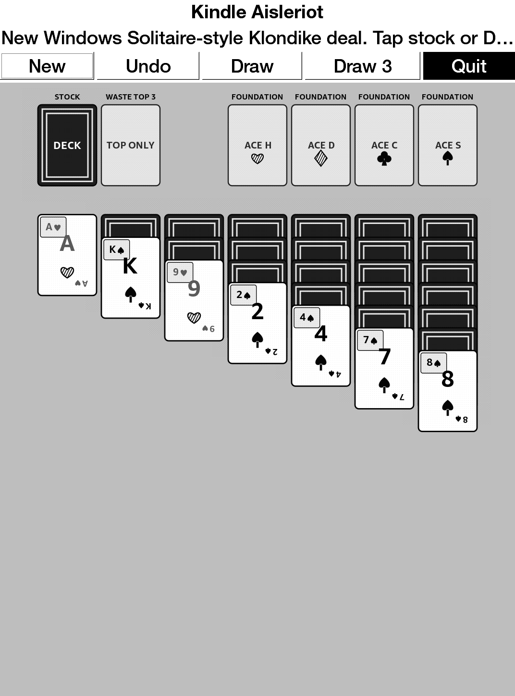

# Kindle Aisleriot

A practical Kindle-friendly Windows Solitaire-style Klondike app inspired by
GNOME Aisleriot, using GTK2/Cairo and the same Mesquite/KUAL packaging approach
as Kindle GlChess.

This v0.1.0 port intentionally takes the practical path: it targets familiar
Windows Solitaire/Klondike play for Kindle instead of trying to embed the full
GNOME Aisleriot Guile/Scheme game collection.

## Screenshot



## Features

- Touch-friendly Windows Solitaire-style Klondike board.
- Stock, waste, tableau, foundations, draw, undo, new game, and quit.
- Draw 1 / Draw 3 mode toggle. Draw 3 is the default classic Klondike mode;
  Draw 1 remains available as an easier/casual option.
- Full-card SVG artwork from SVG Cards 2.0 by David Bellot, with high-contrast
  Kindle corner labels overlaid for e-ink readability.
- KUAL extension package with bundled ARM GTK2/Cairo runtime libraries.

## Install

Use the prebuilt extension package:

```text
release/kindle-aisleriot-extension.zip
```

Unzip it at the Kindle USB-storage root so it creates:

```text
/mnt/us/extensions/kindle-aisleriot
/mnt/us/documents/shortcut_kindleaisleriot.sh
```

Launch from KUAL:

```text
KUAL -> Kindle Aisleriot -> Kindle Aisleriot
```

## Build

```bash
./docker_rebuild.sh
```

If ARM containers are not enabled:

```bash
docker run --privileged --rm tonistiigi/binfmt --install arm
```

## License And Provenance

This is not an official GNOME Aisleriot release and not an official
GnomeGames4Kindle release. GNOME Aisleriot attribution and license notes are in
[docs/PROVENANCE.md](docs/PROVENANCE.md).
